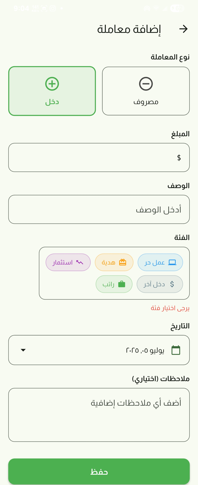
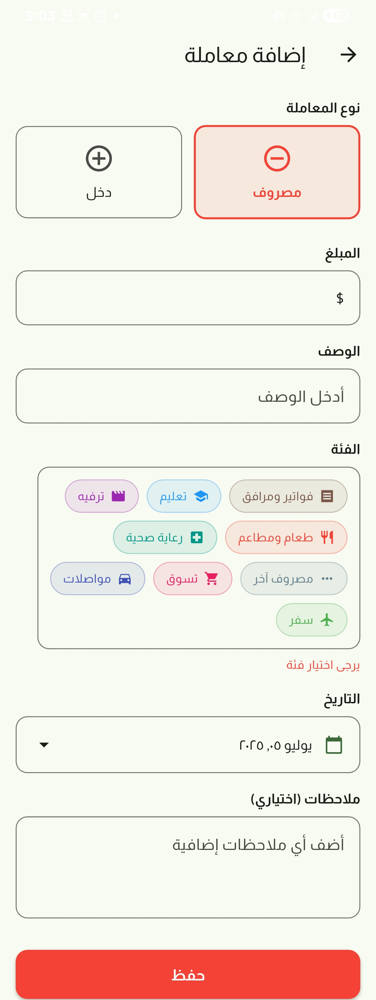
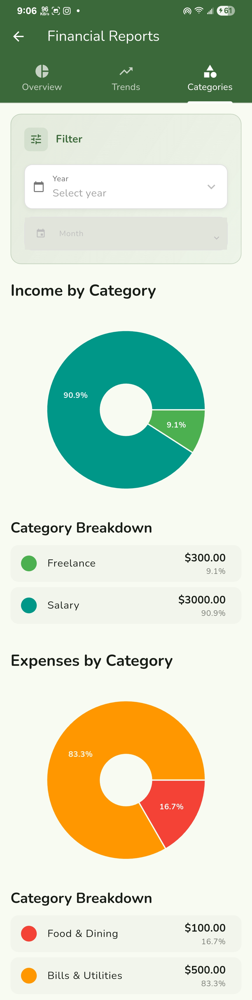
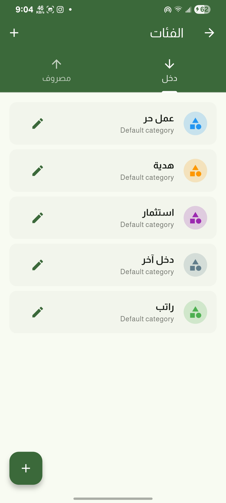
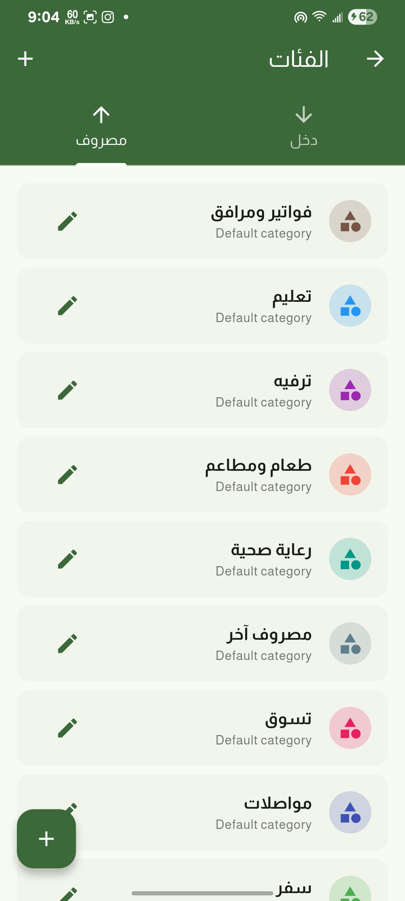
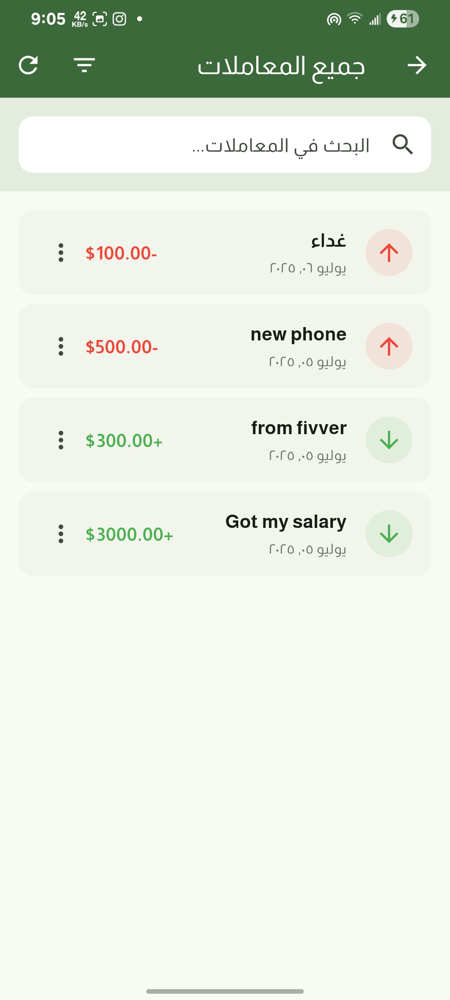
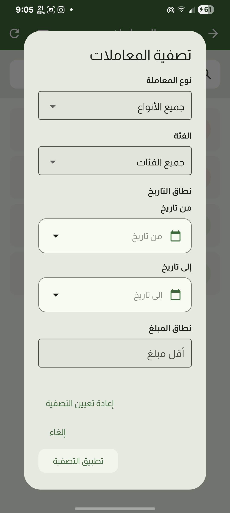
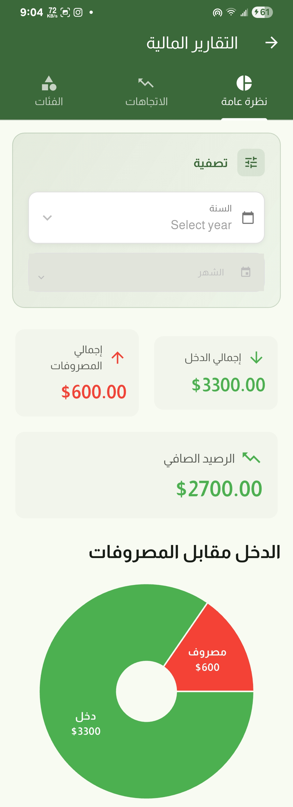
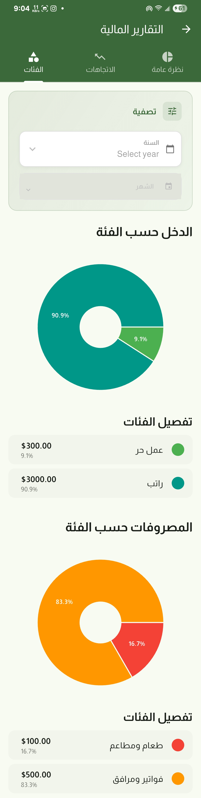

# 💰 Money Manager | مدير الأموال

<div align="center">


**A beautiful and intuitive personal finance management app built with Flutter**

**تطبيق جميل وبديهي لإدارة الأموال الشخصية مبني بتقنية Flutter**

</div>

---

## 🌟 Overview | نظرة عامة

**English:**
Money Manager is a comprehensive personal finance application designed to help you take control of your financial life. With its clean, modern interface and powerful features, managing your income and expenses has never been easier. The app supports both English and Arabic languages, making it accessible to a wider audience.

**العربية:**
مدير الأموال هو تطبيق شامل للأموال الشخصية مصمم لمساعدتك في السيطرة على حياتك المالية. بواجهته النظيفة والحديثة وميزاته القوية، لم تعد إدارة دخلك ومصروفاتك أسهل من أي وقت مضى. يدعم التطبيق اللغتين الإنجليزية والعربية، مما يجعله في متناول جمهور أوسع.

---

## ✨ Features | الميزات

### 📊 **Dashboard & Analytics | لوحة التحكم والتحليلات**
- Real-time financial overview | نظرة عامة مالية في الوقت الفعلي
- Visual charts and graphs | رسوم بيانية ومخططات بصرية
- Monthly and yearly reports | تقارير شهرية وسنوية

<div align="center">


</div>

### 💸 **Transaction Management | إدارة المعاملات**
- Easy income and expense tracking | تتبع سهل للدخل والمصروفات
- Smart categorization system | نظام تصنيف ذكي
- Advanced filtering options | خيارات تصفية متقدمة

<div align="center">




</div>

### 🏷️ **Category Management | إدارة الفئات**
- Customizable income and expense categories | فئات دخل ومصروفات قابلة للتخصيص
- Bilingual category support | دعم الفئات ثنائية اللغة
- Easy category organization | تنظيم سهل للفئات

<div align="center">


</div>

### 📈 **Financial Reports | التقارير المالية**
- Comprehensive financial analysis | تحليل مالي شامل
- Filter by year and month | تصفية حسب السنة والشهر
- Visual representation of spending patterns | تمثيل بصري لأنماط الإنفاق

<div align="center">



</div>

### 🔍 **Advanced Filtering | التصفية المتقدمة**
- Filter transactions by type, category, and date | تصفية المعاملات حسب النوع والفئة والتاريخ
- Smart search functionality | وظيفة البحث الذكي
- Quick access to specific transactions | وصول سريع للمعاملات المحددة

<div align="center">


</div>

---

## 🌐 Multilingual Support | الدعم متعدد اللغات

The app fully supports both **English** and **Arabic** languages with:
- Complete UI translation | ترجمة كاملة لواجهة المستخدم
- Right-to-left (RTL) layout support | دعم التخطيط من اليمين إلى اليسار
- Localized number formatting | تنسيق الأرقام المحلي

---

## 🛠️ Technical Stack | المكدس التقني

- **Framework:** Flutter
- **Language:** Dart
- **Architecture:** MVVM with Cubit State Management
- **Database:** SQLite (sqflite)
- **Localization:** flutter_localizations
- **Charts:** fl_chart

---

## 📱 Screenshots | لقطات الشاشة

<details>
<summary>View All Screenshots | عرض جميع لقطات الشاشة</summary>

### Arabic Interface | الواجهة العربية
<div align="center">









</div>

### English Interface | الواجهة الإنجليزية
<div align="center">


</div>

</details>

---

## 🚀 Getting Started | البدء

### Prerequisites | المتطلبات المسبقة
- Flutter SDK (>=3.0.0)
- Dart SDK (>=3.0.0)
- Android Studio / VS Code
- Android/iOS device or emulator

### Installation | التثبيت

1. **Clone the repository | استنساخ المستودع**
   ```bash
   git clone https://github.com/your-username/money_manager.git
   cd money_manager
   ```

2. **Install dependencies | تثبيت التبعيات**
   ```bash
   flutter pub get
   ```

3. **Run the app | تشغيل التطبيق**
   ```bash
   flutter run
   ```

---

## 🏗️ Project Structure | هيكل المشروع

```
lib/
├── core/           # Core utilities and constants
├── data/           # Data layer (repositories, data sources)
├── domain/         # Business logic and entities
├── presentation/   # UI layer (screens, widgets, cubits)
├── l10n/          # Localization files
└── main.dart      # App entry point
```

---

## 🤝 Contributing | المساهمة

**English:**
Contributions are welcome! Please feel free to submit a Pull Request. For major changes, please open an issue first to discuss what you would like to change.

**العربية:**
المساهمات مرحب بها! لا تتردد في تقديم طلب سحب. للتغييرات الكبيرة، يرجى فتح مشكلة أولاً لمناقشة ما تريد تغييره.

---

## 📄 License | الترخيص

This project is licensed under the MIT License - see the [LICENSE](LICENSE) file for details.

هذا المشروع مرخص تحت رخصة MIT - راجع ملف [LICENSE](LICENSE) للتفاصيل.

---

## 👨‍💻 Developer | المطور

**Developed with ❤️ by Ameen Radman**

**تم التطوير بـ ❤️ بواسطة أمين ردمان**

---

<div align="center">

**⭐ If you found this project helpful, please give it a star! ⭐**

**⭐ إذا وجدت هذا المشروع مفيداً، يرجى إعطاؤه نجمة! ⭐**

</div>
