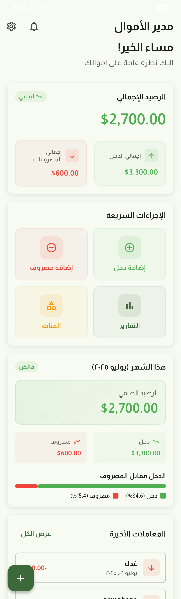
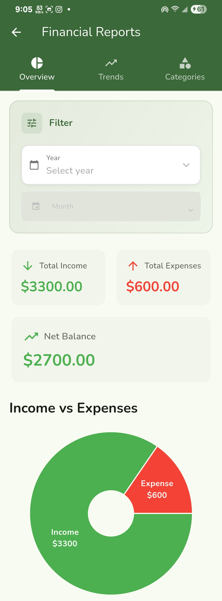

# Money Manager | مدير الأموال

A personal finance app built with Flutter that supports both English and Arabic.

تطبيق لإدارة الأموال الشخصية مبني بـ Flutter يدعم اللغتين الإنجليزية والعربية.

## About | حول التطبيق

This app helps you track your income and expenses with an easy-to-use interface. It works in both English and Arabic languages.

هذا التطبيق يساعدك في تتبع دخلك ومصروفاتك بواجهة سهلة الاستخدام. يعمل باللغتين الإنجليزية والعربية.

## Features | الميزات

- Track income and expenses | تتبع الدخل والمصروفات
- Organize transactions by categories | تنظيم المعاملات حسب الفئات
- View financial reports with charts | عرض التقارير المالية مع الرسوم البيانية
- Filter transactions by date and type | تصفية المعاملات حسب التاريخ والنوع
- Supports English and Arabic languages | يدعم اللغتين الإنجليزية والعربية

## Screenshots | لقطات الشاشة

### Settings | الإعدادات

### Dashboard | لوحة التحكم
 

### Add Income/Expense | إضافة دخل/مصروف
 

### Categories | الفئات
 

### Reports | التقارير
 

### All Transactions | جميع المعاملات
 

## Getting Started | البدء

1. Make sure you have Flutter installed | تأكد من تثبيت Flutter
2. Clone this project | استنسخ هذا المشروع
3. Run `flutter pub get` | شغل الأمر
4. Run `flutter run` | شغل التطبيق

## Built With | مبني باستخدام

- Flutter
- SQLite for local storage | قاعدة بيانات محلية
- Cubit for state management | إدارة الحالة

---

**Developer: Ameen Radman | المطور: أمين ردمان**
